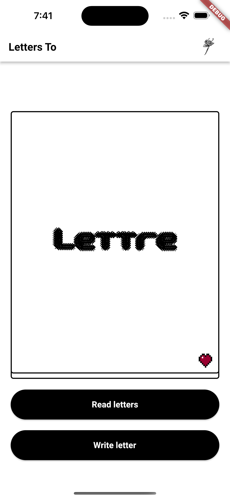

# lettre

A Flutter project where you can write letters like the old days to your loved ones and to yourself and keep them as a memory. 
The project implements object-oriented programming concepts and database managment concepts, utilizing Firebase. 

  

  

